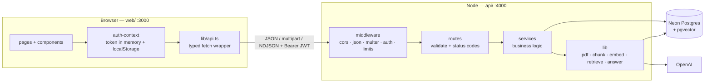
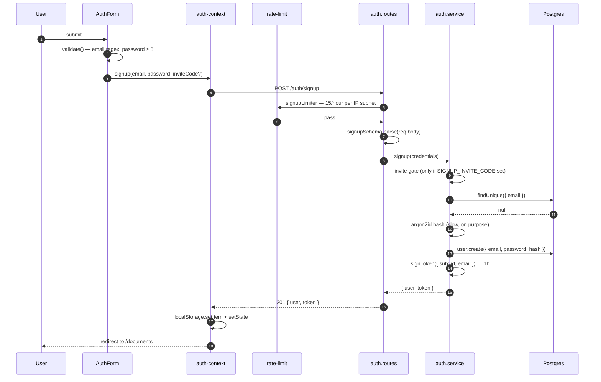
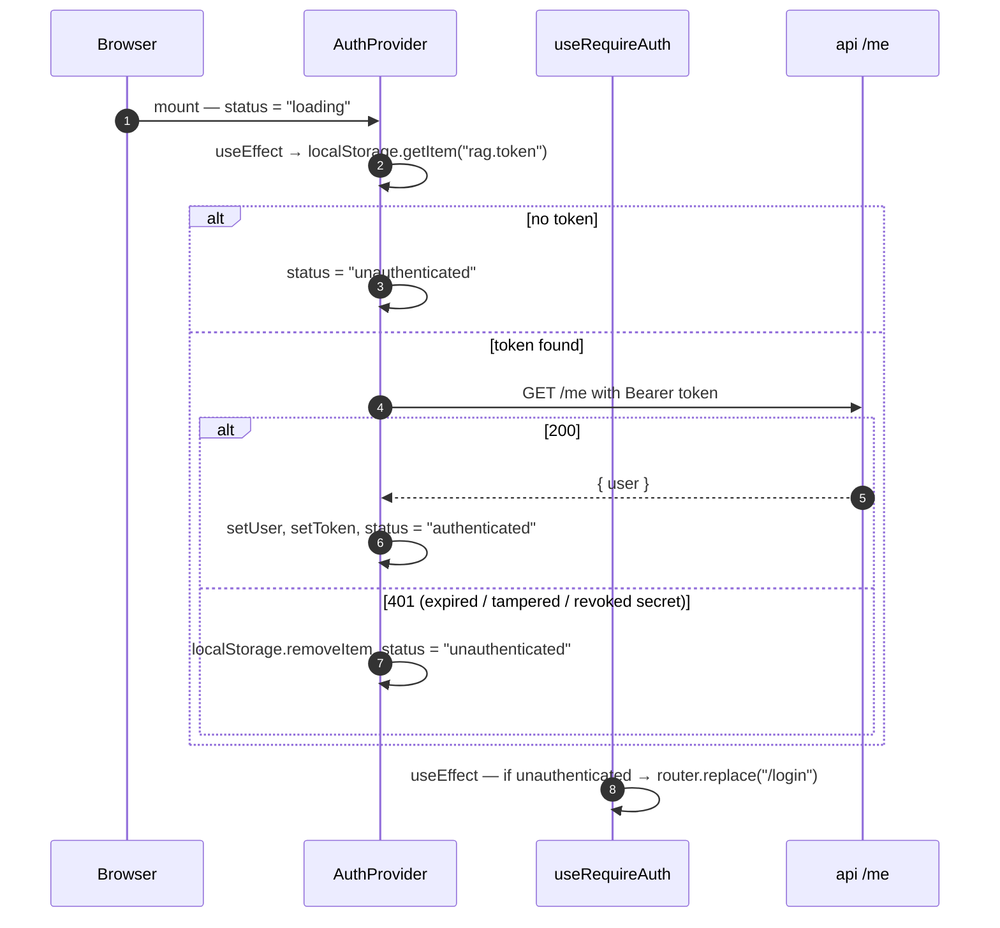
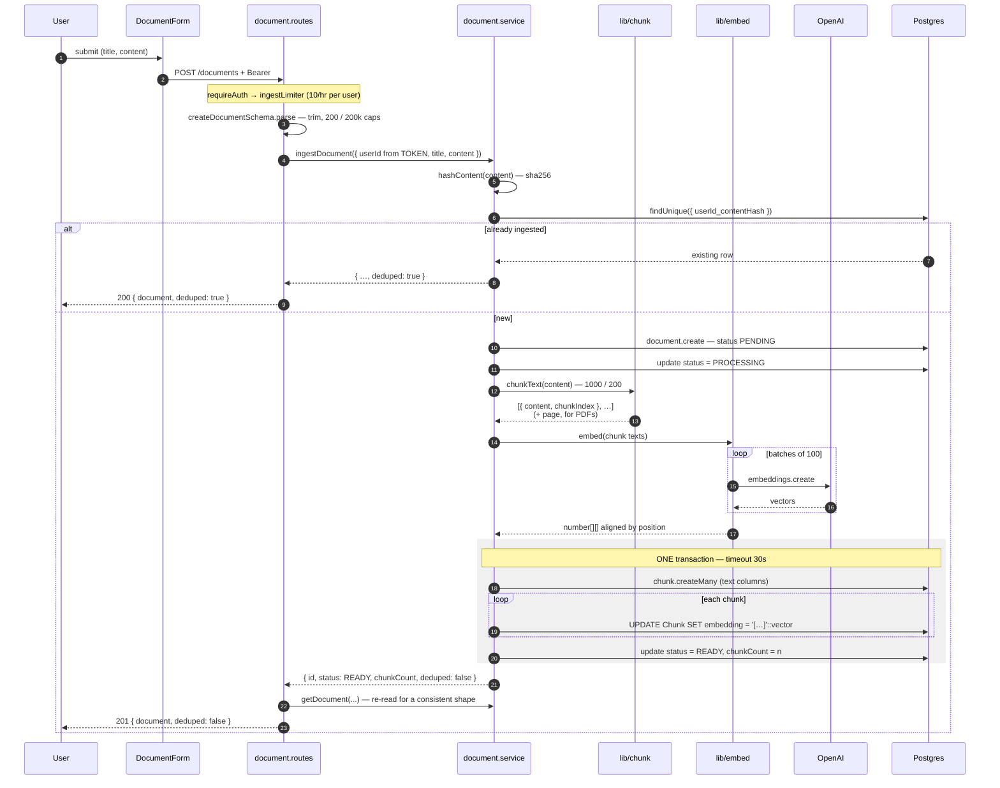
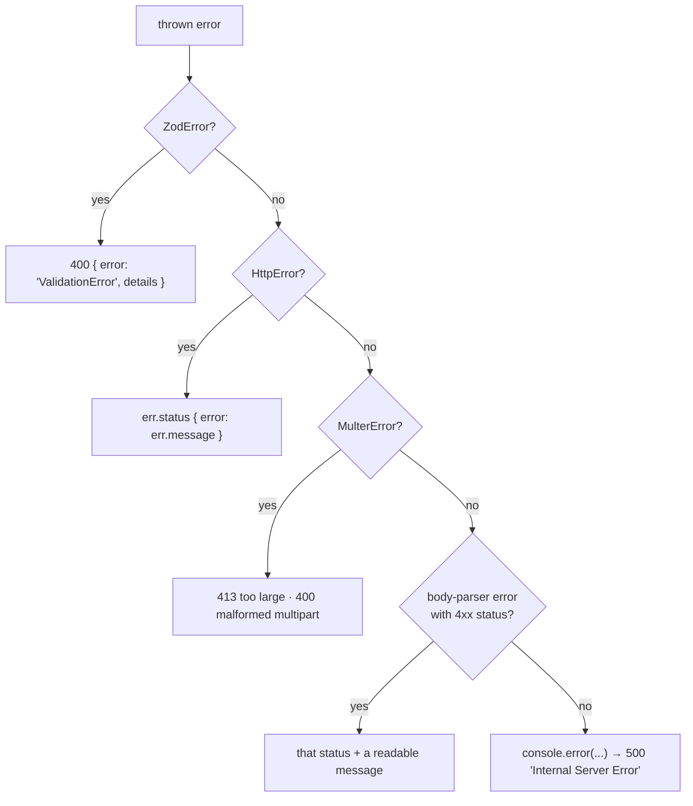

# Flows — every request traced end to end

**Who this is for:** you, needing to answer *"walk me through what happens when a user asks a
question"* without pausing.

**Prerequisite:** [`concepts.md`](concepts.md). This doc assumes you know what an embedding, a JWT,
and a middleware chain are — it shows them working together.

**How to read a flow:** each one goes click → network → code → database → back to the screen, in
order, with the file and line for every step. The **⚠️ Failure modes** table at the end of each flow
is what interviewers actually dig into.

---

## The map



**The rule that never breaks:** the browser is untrusted. Every `userId` used anywhere on the server
comes from a **verified token**, never from a request body. `createDocumentSchema` and `askSchema`
both deliberately omit the field, so there is no JSON key a client could set to act as someone else.

---

## Flow 0 — Boot

Before any request exists.

| # | What happens | Where |
|---|---|---|
| 1 | `tsx` loads `index.ts`, which imports `app.ts`, which imports everything else | [`index.ts`](../api/src/index.ts) |
| 2 | `env.ts` runs `dotenv/config`, then validates `process.env` against a zod schema | [`env.ts`](../api/src/lib/env.ts) |
| 3 | **Invalid env → `process.exit(1)`** with a per-field message | [`env.ts`](../api/src/lib/env.ts#L30-L37) |
| 4 | `prisma.ts` builds the `PrismaPg` adapter and the client singleton | [`prisma.ts`](../api/src/lib/prisma.ts) |
| 5 | `openai.ts` builds one shared OpenAI client | [`openai.ts`](../api/src/lib/openai.ts) |
| 6 | `jwt.ts` encodes `JWT_SECRET` to bytes once, at module load | [`jwt.ts`](../api/src/lib/jwt.ts#L5) |
| 7 | `createApp()` wires middleware and routers in order | [`app.ts`](../api/src/app.ts#L19) |
| 8 | `app.listen(4000)` | [`index.ts`](../api/src/index.ts#L6) |

**Why fail-fast at boot matters:** a missing `OPENAI_API_KEY` is a config mistake. Discovering it
during the first user's ingestion — after a document row was created and the user is watching a
spinner — is strictly worse than refusing to start. **Push failures as early as possible in the
lifecycle.**

**Why the Prisma singleton is guarded:**

```ts
const globalForPrisma = globalThis as unknown as { prisma?: PrismaClient };
export const prisma = globalForPrisma.prisma ?? new PrismaClient({ adapter });
if (env.NODE_ENV !== "production") globalForPrisma.prisma = prisma;
```

`tsx watch` reloads this module on every save. Without the guard, each save spawns a fresh client
*and a fresh connection pool*, and you exhaust Neon's connection limit after a few dozen edits.
Stashing it on `globalThis` survives module reload because the global object doesn't. (Same pattern,
same reason, as every Next.js Prisma setup you've seen.)

---

## Flow 1 — Signup

**User action:** fills the form at `/signup`, clicks *Create account*.



### Step by step

**1. Client validation** — [`AuthForm.tsx:33-38`](../web/src/components/AuthForm.tsx#L33-L38).
Mirrors the server's zod rules. **UX only.** It saves a round-trip; the server's copy is the one
that's load-bearing. An attacker never opens your form.

**2. Rate limit before anything else** — [`auth.routes.ts:18`](../api/src/modules/auth/auth.routes.ts#L18).
The limiter runs **before** the handler, which is the entire point: it must reject without touching
the database and without running argon2. *A limiter placed after the expensive work still bills you
for the work.*

Signup costs no OpenAI money directly — so why limit it at all? Two reasons, and both are good
interview answers:
- It's the gate in front of everything that *does* cost money. Per-user budgets mean nothing if
  accounts are free and unlimited.
- It's the most expensive route running on **your own hardware**. argon2id is deliberately slow, so
  a signup flood is a CPU-exhaustion attack on a single instance.

Sized at 15/hour per **subnet** rather than lower, because the link is going on LinkedIn: mobile
carriers run CGNAT, so one public IPv4 can mean an entire city block of subscribers. Too low here
protects nothing and turns real visitors away.

**3. Schema parse** — `signupSchema.parse(req.body)`. Throws `ZodError` on bad input, which Express 5
forwards to the error middleware → `400 { error: "ValidationError", details: [...] }`.

Note `inviteCode` **must** be declared in the schema even though it's optional: zod **strips unknown
keys**, so without that line the field would be silently removed before the service ever saw it, and
the gate would reject everyone. ([`auth.schema.ts:13-24`](../api/src/modules/auth/auth.schema.ts#L13-L24))

**4. The invite gate** — [`auth.service.ts:34-36`](../api/src/modules/auth/auth.service.ts#L34-L36).
Off by default *on purpose*: a recruiter opening the demo must not hit a wall. Setting
`SIGNUP_INVITE_CODE` closes the door in **one config change, no code deploy** — the lever to pull
when the OpenAI spend alert fires, not a rewrite at 2am.

The comparison is a plain `!==`, not `crypto.timingSafeEqual`. That's considered, not lazy: this is
a coarse gate, not a password, and guessing it is bounded to 15 attempts/hour by the limiter — a far
tighter bound than any timing side-channel could overcome. A secret worth more than this would
deserve a per-invite database record.

**5. Duplicate check → 409.** Unlike login, signup *does* reveal whether an email is registered.
That's unavoidable — you cannot let two people register the same email and also not tell them why it
failed.

**6. Hash the password.** `await hashPassword(password)` — argon2id, salt generated and embedded
automatically.

**7. Sign a token and return it.** The user is logged in immediately after signup; no separate login
round-trip.

**8. `toPublicUser()`** strips everything but `id` and `email`. The password hash never leaves the
service.

**9. Client stores the token** — [`auth-context.tsx:77-82`](../web/src/lib/auth-context.tsx#L77-L82).
React state (for the running app) mirrored to `localStorage` (so a refresh doesn't log you out).

### ⚠️ Failure modes

| Situation | Response | Why that one |
|---|---|---|
| Bad email / password < 8 | `400` + per-field `details` | zod, before any work |
| Email already registered | `409 "Email already registered"` | Correct semantic: conflict with existing state |
| Invite required, wrong/missing code | `403 "Sign-ups are invite-only right now."` | Renders as a normal server message; the form needs no special case |
| >15 signups from one subnet in an hour | `429` + `Retry-After` | Before DB and argon2 |
| Body > 1 mb | `413 "Request body too large (limit …)"` | body-parser branch of the error middleware |

### 🔒 Security notes to be able to state

- The password hash **never** appears in a response — `toPublicUser()` is an explicit allow-list.
- `localStorage` is readable by JavaScript, so a successful XSS steals the token. **This is a known,
  deliberate trade** — it's simple and works against the API unchanged. The hardening step is an
  `httpOnly` cookie (invisible to JS), which requires an API change *and* CSRF protection, and it's
  flagged as future work rather than pretended away.

---

## Flow 2 — Login

Nearly identical to signup, with three differences that are each worth a sentence in an interview.

**1. `skipSuccessfulRequests: true`** — [`rate-limit.ts:139-145`](../api/src/middleware/rate-limit.ts#L139-L145).
Only **failed** logins consume the budget. This is the difference between a limit that stops
credential stuffing and a limit that punishes a real user with two devices and a typo.

**2. One error for two causes** — [`auth.service.ts:56-58`](../api/src/modules/auth/auth.service.ts#L56-L58):

```ts
if (!user || !(await verifyPassword(user.password, password))) {
  throw new HttpError(401, "Invalid email or password");
}
```

Unknown email and wrong password produce the **identical** message. Otherwise the endpoint becomes a
**user-enumeration oracle**: an attacker feeds it an email list and learns exactly who has an
account — valuable for phishing, and a GDPR problem on its own.

**3. The remaining hole, which you should raise before they do.** The messages match, but the
**timings don't**. Unknown email → one DB lookup, return immediately. Known email → DB lookup **plus
a deliberately slow argon2 verify**. That measurable difference re-opens enumeration through a timing
side-channel.

The fix is standard: verify against a **dummy hash** when the user isn't found, so both paths pay the
same cost. It's noted in the project status as deferred — knowing it exists and naming the fix is
worth more than having silently shipped it.

---

## Flow 3 — Session rehydration and the protected-route guard

**User action:** refreshes the page, or opens `/documents` in a new tab.



**Why `status` starts as `"loading"` on both server and client:** Next.js renders on the server,
where `localStorage` doesn't exist. If the initial state depended on it you'd get a **hydration
mismatch**. The read happens inside `useEffect`, which only runs in the browser.

**Why call `/me` at all instead of trusting the stored token?** The token could be expired, or signed
with a secret that has since rotated. `/me` is the cheapest possible proof it's still good — it's
just `requireAuth` plus echoing `req.user`.

**The elegant part:** an expired token resolves to `"unauthenticated"`, which is the *same* state as
"never logged in" — so **one redirect path covers both**. No special "your session expired" branch to
get wrong.

**The `cancelled` flag** ([`auth-context.tsx:49-75`](../web/src/lib/auth-context.tsx#L49-L75)) drops
a `/me` result that arrives after unmount — the standard React race guard you already know.

**`useRequireAuth` is a UX guard, not a security boundary** —
[`use-require-auth.ts:16-18`](../web/src/lib/use-require-auth.ts#L16-L18). It hides UI. It protects
nothing. Anyone can open devtools and set `status` to whatever they like. **What actually keeps one
user's documents away from another is that every API route independently verifies the token.** Say
that sentence exactly if you're asked about frontend auth — it's the distinction that separates
someone who's shipped auth from someone who's read about it.

### How `requireAuth` works on the server

```ts
// api/src/middleware/auth.ts
const header = req.headers.authorization;
if (!header?.startsWith("Bearer ")) throw new HttpError(401, "Missing or malformed …");
const token = header.slice("Bearer ".length);
let claims;
try { claims = await verifyToken(token); }
catch { throw new HttpError(401, "Invalid or expired token"); }   // ← all failures collapse to one
req.user = { id: claims.sub, email: claims.email };
next();
```

Expired, tampered, and garbage all produce the **same** 401. A client has no legitimate use for the
difference, and distinguishing them tells an attacker which of their guesses was closer.

**Where it's mounted matters more than what it does** —
[`app.ts:81`](../api/src/app.ts#L81):

```ts
app.use("/documents", requireAuth, documentRouter);   // ← at the MOUNT POINT
```

Not inside `document.routes.ts` per route. Forgetting the middleware on a newly added route is a
classic way to ship an unauthenticated endpoint. Mounting it here makes that **structurally
impossible** — every current *and future* route in that router is covered.

---

## Flow 4 — Ingest a document (the write path)

**User action:** at `/documents`, either pastes text and clicks *Ingest document*, or picks a PDF
and clicks *Upload PDF*.

This is the flow with the most moving parts. Take it slowly.

Two entry points converge almost immediately. The PDF route does its own work up front — parse the
multipart body, verify the bytes, extract text page by page — and then calls **the same
`ingestDocument`** the paste route does, with one extra argument. Everything after that point is
byte-for-byte identical, which is the whole design: the pipeline never learns that PDFs exist, so
the next format is a new parser rather than a new branch through chunking, embedding and persistence.



### The decisions inside, in order

**1. The limiter is on `POST` alone, not the mount point** —
[`document.routes.ts:31`](../api/src/modules/documents/document.routes.ts#L31). Ingestion is the only
route in this router that costs anything (it embeds up to ~200 chunks). The two GETs are reads of
rows the user already paid for. Sharing one bucket would mean a dashboard **polling** a `PROCESSING`
document could exhaust the budget for **uploading** one — a self-inflicted outage.

**1b. The PDF route's five steps before it rejoins the paste path.** Order is deliberate: each step
is cheaper than the one after it, so the common failures cost the least.

| # | Step | Rejects with | Why here |
|---|---|---|---|
| 1 | `ingestLimiter` → `multer.single("file")` | `429` / `413` / `400` | The limiter runs **before** multer, so a rate-limited caller is turned away without us first accepting and buffering 10 MB from them |
| 2 | `req.file` present? | `400` | Multer does not treat a missing file as an error — without this check it's a `TypeError` surfacing as a `500` |
| 3 | Leading bytes are `%PDF-`? | `400` | See below — this is the only real check on file type |
| 4 | `extractPdf` → per-page text; `hasNoText`? | `400` corrupt / password-protected · **`422`** scanned | `422` because the request and the file were both fine; there is simply nothing to index |
| 5 | `pages.join("\n\n").trim()` → over 200k? | `400` | Extracted text never passes through a body schema, so the paste path's ceiling is enforced again by hand |

**1c. `Content-Type` is a claim; magic bytes are evidence.** `req.file.mimetype` is not an
inspection of the file — multer copies it from the header the *client* wrote into that part of the
multipart body. `curl -F "file=@evil.html;type=application/pdf"` asserts whatever it likes, and
multer reports it with total confidence. The `%PDF-` check reads the actual first five bytes.
Verified: the forged-content-type case returns `400 "That file isn't a PDF."`

Be precise about what this is, because an interviewer will push: it is **necessary, not
sufficient** — it proves the file *starts* like a PDF, not that it is valid or benign. The real
guarantee is that pdf.js either parses it or throws, plus the fact that the bytes are never stored
and never served back, which is what rules out the classic "upload HTML, get it served, browser
sniffs it, stored XSS" path. In *this* app it is defence-in-depth and a better error message, not
an exploit being stopped. Claiming more than that is how you lose the room.

**1d. `express.json({ limit: "1mb" })` does not apply here, and knowing why is the point.** Body
parsers are **content-type-gated**: `express.json()` checks the `Content-Type` header first, sees
`multipart/form-data; boundary=…`, and calls `next()` having read zero bytes. Its limit is never
consulted. Multer's `limits.fileSize` is the *only* bound on an upload — get it wrong and there is
no bound at all. (Frontend analogy: event delegation. One listener fires for every click, but the
handler opens with `if (!e.target.matches('.btn')) return`.)

**2. `userId` comes from the token, spread order matters:**

```ts
await documentService.ingestDocument({ userId: currentUserId(req), ...input });
```

`input` is the zod-parsed body. Because `userId` isn't in the schema, a client sending one has it
stripped before this line — so the spread cannot overwrite it. Two independent defences.

**3. Dedupe *before* any work** — [`document.service.ts:84-85`](../api/src/modules/documents/document.service.ts#L84-L85).
Re-uploading the same file is the common case (a user retries, or syncs a folder twice), and
embedding is the expensive step. Ingestion is therefore **idempotent per (user, content)**: same text
in, same document id out.

Why SHA-256 with no salt, when passwords demand the opposite? Because here we **want** identical
input to collide — that's what a fingerprint is for. Same primitive family, inverted requirement.

**4. Two separate try/catch blocks, and this is the subtle one.** The `document.create` sits in its
own:

```ts
let doc: { id: string };
try { doc = await prisma.document.create({ … }); }
catch (err) { … }        // ← until this succeeds there is no row to mark FAILED
try { /* the whole pipeline */ }
catch (err) { /* mark the row FAILED */ }
```

You cannot record a failure on a row that doesn't exist yet. Collapsing these into one block would
mean the failure handler references `doc.id` before `doc` is assigned.

**5. The race the unique constraint catches** —
[`document.service.ts:98-106`](../api/src/modules/documents/document.service.ts#L98-L106):

```
T1: findByHash → null              T2: findByHash → null
T1: INSERT ✓                       T2: INSERT ✗  Prisma P2002
                                   T2: re-read the winner → { deduped: true }
```

**`findByHash` is an optimisation; `@@unique([userId, contentHash])` is the guarantee.** Two
concurrent requests can both pass the check. One wins; the loser catches P2002, re-reads, and returns
the winner's row. Both callers get a correct answer and only one document exists.

This is the generalisable lesson: **application-level checks cannot enforce uniqueness under
concurrency — only the database can.** Check first for the common path, catch the constraint for
correctness.

**6. Chunking and embedding run OUTSIDE any transaction** —
[`document.service.ts:121-139`](../api/src/modules/documents/document.service.ts#L121-L139). Chunking
is CPU work; embedding is a multi-second network round-trip to OpenAI. Holding a Postgres transaction
open across a slow external call pins a connection from a small pool for the whole trip. That's how a
slow dependency becomes a database outage.

**7. Three arrays aligned by index.** `chunks[i]`, `vectors[i]`, and `chunkIndex === i` all line up,
because `embed()` preserves input order (and defensively sorts each batch response by `index`). This
alignment is the whole reason the two-step write below works.

**8. Why the write is two steps.** Prisma cannot write the `Unsupported("vector(1536)")` column
through `createMany`. So:

```ts
await tx.chunk.createMany({ data: chunks.map(…) });   // (a) text columns; Prisma generates ids
for (let i = 0; i < chunks.length; i++) {              // (b) then vectors, via raw SQL
  await tx.$executeRaw`UPDATE "Chunk" SET embedding = ${literal}::vector
                       WHERE "documentId" = ${doc.id} AND "chunkIndex" = ${chunks[i].chunkIndex}`;
}
```

Rows are matched on `(documentId, chunkIndex)` — a natural key here — so the generated ids never need
to be read back. `literal` is the text form `[0.1,0.2,…]`, cast to `vector`. **The same
representation is used on the read side**, which is a small consistency worth noticing.

**9. `chunkCount` is denormalised deliberately.** Listing documents shouldn't need a `COUNT(*)` join
against `Chunk`. It's written **inside the same transaction as the rows it counts**, so it cannot
drift.

**10. The failure handler swallows its own errors:**

```ts
await prisma.document.update({ where: { id: doc.id },
  data: { status: "FAILED", error: err.message } }).catch(() => {});
throw err instanceof HttpError ? err : new HttpError(500, "Failed to ingest document", { cause: err });
```

Best-effort bookkeeping so the doc doesn't sit in `PROCESSING` forever — and `.catch(() => {})` so a
failure *in the error handler* can't mask the **original** failure, which is the one worth reporting.

**11. The route re-reads the row before responding** —
[`document.routes.ts:43-50`](../api/src/modules/documents/document.routes.ts#L43-L50). One cheap
`SELECT` buys a real simplification on the client: `POST /documents` and `GET /documents/:id` return
the **identical shape**, so there's one `Document` type, one renderer, and a polling loop that
doesn't special-case the response that started it.

**12. `200` vs `201`.** `201 Created` would be a lie when nothing was created. The `deduped` flag
rides along so the UI can say *"already in your library"* instead of a misleading *"uploaded."*

### ⚠️ Failure modes — and the one that's a genuine dead end

| Situation | What happens now | Assessment |
|---|---|---|
| Empty / whitespace content | `400` from zod (`.trim()` before `.min(1)`) | ✅ |
| Content > 200,000 chars | `400` with a field message | ✅ Deliberately below the 1 mb JSON limit, so it fails here with a readable message rather than as a bare 413 |
| Duplicate content | `200` + `deduped: true` | ✅ Idempotent |
| Upload: not a PDF, or forged `Content-Type` | `400` from the magic-byte check | ✅ Verified with an HTML file renamed `.pdf`, sent both honestly and with `;type=application/pdf` |
| Upload: file > 10 MB | `413` | ✅ Needed its own `MulterError` branch in the error middleware — it was a `500` before that |
| Upload: no file / wrong field name | `400` | ✅ |
| Upload: corrupt or password-protected | `400`, each with its own message | ✅ pdf.js `PasswordException` matched by `name`, not by message text, which is prose and version-dependent |
| Upload: scanned / image-only PDF | `422` naming the cause | ✅ The most likely real-world failure. A generic error here makes the app look broken rather than the file unsupported |
| Upload: extracted text > 200,000 chars | `400` — **rejected, not truncated** | ✅ Silently keeping the first 200k produces a document the user believes is complete, then a confident "that isn't in your documents" for anything past the cut. A failed upload is recoverable; a silently incomplete corpus is not |
| Two PDFs, same text, different images | `200` + `deduped: true`, UI names the existing document | ✅ Correct, and the message has to work harder here than on the paste path — dedupe is on **text**, so the filename the user just picked never appears in the list |
| Concurrent duplicate | P2002 caught, winner returned | ✅ |
| Chunking yields 0 chunks | `READY`, `chunkCount: 0` | ✅ A valid outcome, not an error |
| OpenAI 429 mid-embed | `FAILED` + reason, `500` to client | 🔴 **See below** |
| Process crashes mid-pipeline | Row stuck in `PROCESSING` forever | 🔴 No reaper, no lease timeout |
| Very large document | Blocks the request for the full pipeline | 🟡 Survivable under Cloud Run's 300s ceiling, but with no headroom |

🔴 **The dead end, and you should raise it yourself.** A single transient OpenAI 429 fails the whole
document. `status` becomes `FAILED`, and the only recovery is the user re-uploading — which the
`contentHash` dedupe check then **rejects as a duplicate**, because a `FAILED` row still satisfies
`@@unique([userId, contentHash])`. The user is stuck with a permanently broken document and no way to
retry.

All three red rows are fixed by the same change: **move ingestion off the request onto a job queue**
(`pg-boss`, same database), where retry-with-backoff and a lease timeout are the queue's job rather
than yours. `ingestDocument` keeps its **exact current signature** and becomes the job handler's body
— which is precisely why the service layer holds no HTTP. Designed in
[`lld.md §4.2`](lld.md#42-target---enqueue-and-return); not built.

### The state machine that exists in vocabulary but not yet in behaviour

```
PENDING ──> PROCESSING ──> READY
                 └───────> FAILED (+ error message)
```

[`document.service.ts:113-115`](../api/src/modules/documents/document.service.ts#L113-L115) says the
state machine exists so "the frontend never has to wait on us." **That is not true today** — the
`PENDING → PROCESSING` transition happens, but nothing observes it; the client is blocked inside the
same request until everything commits.

The frontend is already built for the future, though. [`documents/page.tsx`](../web/src/app/documents/page.tsx#L66-L85)
has a polling effect that runs only while something is non-terminal:

```ts
const hasProcessing = documents.some(isProcessing);
useEffect(() => {
  if (!token || !hasProcessing) return;      // ← no polling on an idle page
  const timer = setInterval(…, 1500);
  return () => clearInterval(timer);
}, [token, hasProcessing]);
```

Today it never runs, because documents arrive already `READY`. **That's the point** — the day the API
starts answering `202 Accepted` with `PENDING`, this begins working with no frontend change. It polls
the *list* rather than each document, so it's one request per tick regardless of count, and it picks
up documents ingested in another tab for free.

---

## Flow 5 — List documents

Short, but it contains the tenant-isolation pattern in its cleanest form.

```
GET /documents  →  requireAuth  →  listDocuments({ userId: req.user.id })
                                   → findMany({ where: { userId },
                                                orderBy: { createdAt: "desc" },
                                                select: documentSelect })
```

**The explicit `select` is a security decision, not a style one** —
[`document.service.ts:224-231`](../api/src/modules/documents/document.service.ts#L224-L231). Two
columns must never go over the wire:

- **`content`** — the full raw text. Returning it from the *list* endpoint would mean a user with 50
  documents downloads their entire corpus to render a sidebar.
- **`embedding`** — 1536 floats of no use to a client. (Prisma wouldn't return an `Unsupported()`
  column anyway, but the intent is the point.)

`error` **is** included, so a `FAILED` document explains itself in the list without a follow-up
request per failed row.

**The index that serves this exact query:** `@@index([userId, createdAt(sort: Desc)])`. Postgres seeks
straight to this user's slice and walks it **already ordered** — no sort step at all. A composite
index matching your `WHERE` + `ORDER BY` is the single highest-leverage database optimisation, and
this one was designed alongside the query rather than added after a slow-query alert.

**`GET /documents/:id` and the IDOR pattern** —
[`document.service.ts:256-288`](../api/src/modules/documents/document.service.ts#L256-L288):

```ts
const document = await prisma.document.findFirst({ where: { id, userId } });
if (!document) throw new HttpError(404, "Document not found");
```

Ownership is **in the query**, not checked after the fact — so a future edit cannot forget it. And
the status is **404, not 403**: a 403 would confirm the id is real, letting an attacker enumerate ids
to map another user's library. "No such document" and "not yours" collapse into one
indistinguishable answer — which is also just what the scoped query naturally returns.

**No zod on `:id`, deliberately.** A malformed id, a non-existent id, and someone else's id all
answer with the same 404. Adding a 400 for "wrong format" would be the only response that behaves
differently, for no benefit. *(Caveat noted in the code: this relies on `Document.id` being a text
column. Change it to `@db.Uuid` and Postgres rejects a non-uuid at the cast, turning this into a 500
— at which point validating the param is the fix.)*

---

## Flow 6 — Ask a question (the read path)

**User action:** types a question at `/ask`, clicks *Ask*.

The flagship flow. If you can narrate this one cleanly, you can defend the project.

```mermaid
sequenceDiagram
    autonumber
    participant U as User
    participant P as ask/page.tsx
    participant SA as streamAsk (client)
    participant RT as query.routes
    participant SV as query.service
    participant RE as lib/retrieve
    participant DB as Postgres
    participant AN as lib/answer
    participant AI as OpenAI

    U->>P: submit question
    P->>P: reset state, new AbortController
    P->>SA: streamAsk(token, {question}, signal)
    SA->>RT: POST /queries
    Note over RT: requireAuth → burst → daily → global → concurrency(2)
    RT->>RT: askSchema.parse — k defaults 5, capped 10
    RT->>RT: new AbortController; res.on("close") → abort
    RT->>SV: answerQuestion(...) — generator: NOTHING has run

    Note over RT: headers deliberately NOT sent yet

    RT->>SV: pull first value
    SV->>RE: retrieveChunks({ userId, question, k })
    RE->>AI: embed([question]) — same model as ingestion
    AI-->>RE: 1536-dim vector

    rect rgb(240,240,240)
        Note over RE,DB: transaction exists ONLY to scope SET LOCAL
        RE->>DB: SET LOCAL hnsw.ef_search = 100
        RE->>DB: SET LOCAL hnsw.iterative_scan = 'strict_order'
        RE->>DB: SELECT … WHERE d.userId = $1 AND embedding IS NOT NULL<br/>ORDER BY embedding <=> $2 LIMIT k
    end
    DB-->>RE: rows + cosine distance
    RE-->>SV: RetrievedChunk[] (similarity = 1 - distance)

    SV-->>RT: { type: "sources" }
    RT->>RT: NOW setHeader + flushHeaders()
    Note over RT: status code committed — spent from here on
    RT-->>SA: sources line
    SA-->>P: render source chips immediately

    alt 0 chunks
        AN-->>SV: REFUSAL constant — no model call, no cost
    else
        SV->>AN: streamAnswer({ question, chunks, signal })
        AN->>AI: chat.completions.create(stream: true, temperature: 0)
        loop each delta
            AI-->>AN: delta
            AN-->>SV: string
            SV->>SV: answer += value
            SV-->>RT: { type: "token" }
            RT-->>SA: token line
            SA-->>P: setAnswer(prev => prev + value)
        end
    end

    SV-->>RT: { type: "done", answer }
    RT-->>SA: done line, res.end()
    P->>P: setAnswer(event.answer) — authoritative
```

### Part A — the four guards, in order

[`app.ts:111-123`](../api/src/app.ts#L111-L123). Every position is reasoned:

| Order | Guard | Why exactly here |
|---|---|---|
| 1 | `requireAuth` | Everything after keys on `req.user.id`, which doesn't exist before it runs |
| 2 | `queryBurstLimiter` 10/min | Cheap short window first |
| 3 | `queryDailyLimiter` 50/day | A burst rejection must **not** spend the daily budget |
| 4 | `globalQueryLimiter` 2000/day | After per-user, so one abusive account is stopped by its own budget before eating the shared one |
| 5 | `limitConcurrent(2)` | **Last** — it's the only one holding state for the request's *lifetime*, so it must not increment for a request one of the above is about to reject |

**All of them are in front of the router, and that's what makes a 429 possible at all.** This route
streams; the moment it calls `flushHeaders()` the status code is spent. A limit discovered after that
point could only be reported as an in-band error on a `200`.

**Why 2 concurrent, not 1:** a user who asks, changes their mind, and asks again shouldn't be blocked
by their own abandoned stream in the moment before the socket closes. Beyond that, a human has no
reason to hold three generations open — but a script does.

### Part B — the header-deferral design (the interview centrepiece)

```ts
let headersSent = false;
try {
  for await (const event of events) {
    if (!headersSent) {
      res.setHeader("Content-Type", "application/x-ndjson; charset=utf-8");
      res.setHeader("Cache-Control", "no-store");
      res.setHeader("X-Accel-Buffering", "no");
      res.flushHeaders();
      headersSent = true;
    }
    writeEvent(res, event);
  }
  res.end();
} catch (err) {
  if (abort.signal.aborted) return;      // the client leaving is not a failure
  if (!headersSent) throw err;           // → error middleware → real status code
  writeEvent(res, { type: "error", message: … });   // → in-band, status is spent
  res.end();
}
```

**The constraint:** a response has exactly one status code, committed the instant the first byte
leaves. So the error path forks on one question — *have headers been sent?*

**Generator laziness is what makes it work.** `answerQuestion(...)` returns a generator; **no line of
its body has executed**. Retrieval only runs when the route pulls the first value, *inside* the
`try`. So a DB outage or an OpenAI 429 while embedding the question still throws while a real status
code is available. If the service fetched eagerly, every such failure would be a truncated `200`.

**The three headers each earn their place:**

| Header | Why |
|---|---|
| `application/x-ndjson` | Tells the client what it's parsing |
| `Cache-Control: no-store` | A cached partial answer would be worse than no answer |
| `X-Accel-Buffering: no` | Tells nginx-style proxies not to buffer. **Without it the endpoint still "works"** while the streaming UX silently disappears in production, and only in production |

**`res.on("close") → abort.abort()`.** If the user closes the tab, the abort signal propagates all
the way into the OpenAI request. Without it you'd pay, in full, for tokens streaming into a dead
socket. That signal chain — browser `AbortController` → HTTP socket close → server `AbortController`
→ OpenAI SDK — is a genuinely good thing to be able to trace out loud.

### Part C — retrieval, line by line

[`retrieve.ts`](../api/src/lib/retrieve.ts) — the most security-sensitive file in the codebase.

```ts
if (!question.trim()) return [];                    // ① never embed nothing
const [questionVector] = await embedFn([question]); // ② SAME model as ingestion
const literal = `[${questionVector.join(",")}]`;    // ③ same representation as the write side
```

① A whitespace-only question would embed into a meaningless vector and return the corpus's arbitrary
"average" chunks — noise presented with the same confidence as a real hit.

② If the embedding model ever changes, **every stored vector must be recomputed.** That's the real
cost of switching models, not the code change.

Then the SQL. Every clause defends something:

| Clause | Purpose | What breaks without it |
|---|---|---|
| `JOIN "Document" d` | Gets `documentTitle` for the citation **and** enables the ownership check | Citations have no human-readable label; no way to scope |
| `WHERE d."userId" = ${userId}` | ⚠️ **The tenant scope** | Full-corpus search across every user. **No type error, no failing test.** |
| `AND c.embedding IS NOT NULL` | Excludes unembedded chunks | `NULL <=> vector` is `NULL`, which sorts **last** under `NULLS LAST` — junk surfaces exactly when real matches run out, i.e. when it does the most damage |
| `ORDER BY c.embedding <=> …` | Cosine distance, ascending | Must match `vector_cosine_ops`; using `<->` **silently** bypasses the index and sequential-scans |
| `LIMIT ${k}` | k, capped 1–10 at the schema | An uncapped `k` is a client-controlled way to force an arbitrarily expensive prompt |

**Why `${userId}` isn't injectable:** Prisma's tagged template turns interpolations into **bind
parameters** — Postgres treats them as data, never as SQL. The two `$executeRawUnsafe` calls above
are the exception, and they're safe for one specific reason: Postgres doesn't accept bind parameters
in `SET` (it parses as configuration, not a query), and **both interpolated values are module-level
constants**, never request-derived.

**And the return mapping:**

```ts
distance: Number(row.distance),
similarity: 1 - Number(row.distance),
```

`Number()` even though the pg driver already returns a number: a `NUMERIC` column would arrive as a
**string**, and every downstream `.toFixed()` would throw at runtime instead of failing at compile
time. Cheap insurance against a schema change.

### Part D — generation

[`answer.ts`](../api/src/lib/answer.ts).

```ts
if (chunks.length === 0) { yield REFUSAL; return; }   // no model call, no cost
```

The model cannot answer from empty context, so asking is a **guaranteed** refusal that costs a
round-trip and real money. Both paths emit the identical string, so they're indistinguishable to the
client — which is what makes the refusal detectable by the UI and assertable by an eval.

```ts
const userPrompt = `Sources:\n\n${formatContext(chunks)}\n\n---\n\nQuestion: ${question}`;
```

Context **before** the question: models attend most reliably to a prompt's start and end, so the
question landing last keeps it in the strongest position — and a stable prefix makes prompt caching
possible later.

```ts
for await (const part of stream) {
  const delta = part.choices[0]?.delta?.content;   // ← optional-chain the WHOLE path
  if (delta) yield delta;
}
```

Not every chunk carries text: the first usually announces the role, the last carries only a
`finish_reason`, and `choices` can be an empty array on some events. `choices[0].delta` would throw.

**This file knows nothing about HTTP.** It yields strings; the caller decides whether they become
NDJSON, a WebSocket frame, or one concatenated string in a test. That boundary is what makes answer
logic testable without booting a server.

### Part E — the client side

**1. Why `streamAsk` doesn't reuse `request()`.** That helper does `await res.json()`, which waits for
the **entire** body — the exact opposite of what streaming is for. Streaming needs the raw
`res.body` reader, so it gets its own function rather than a flag on the shared one.

**2. A pre-stream failure is an ordinary error response.**

```ts
if (!res.ok) { const data = await res.json().catch(() => null); throw new ApiError(res.status, …); }
```

The server defers its headers **precisely** so this stays possible. A 401 here behaves exactly like a
401 anywhere else in the app.

**3. Both buffering bugs handled** — see [`concepts.md §1.13`](concepts.md#113-two-stream-parsing-bugs-worth-memorising).
`TextDecoder({ stream: true })` for split UTF-8 characters, and a line buffer for events split across
network chunks.

**4. `finally { reader.cancel() }`.** Runs on early `break`, on an exception, and on abort. A
generator's `finally` fires when the generator is disposed — exactly the guarantee needed. Without
it, a consumer that stops reading leaves the connection open and the browser holding a stream lock.

**5. The React state rules in [`ask/page.tsx`](../web/src/app/ask/page.tsx):**

| Code | Why |
|---|---|
| `abortRef` is a **ref**, not state | Aborting must not trigger a render, and the handler needs the **current** controller. A state value is captured by the closure at the render that created it, so *Stop* could abort a request that already finished. |
| `setAnswer(prev => prev + value)` | **Functional update.** Tokens land faster than React commits; `setAnswer(answer + value)` reads a stale `answer` from this render's closure and drops characters. Only shows up under speed — the classic version of this bug. |
| `case "done": setAnswer(event.answer)` | The server's assembled answer is authoritative. Repairs any drift; costs nothing since they normally match. |
| `useEffect(() => () => abortRef.current?.abort(), [])` | Abort on unmount. Navigating away mid-answer stops the server generating (and you paying for) tokens nobody will read. |
| `switch (event.type)` on a discriminated union | Adding a server-side event surfaces as a **TypeScript error**, not a silently ignored message |

**6. Progressive disclosure.** Sources arrive **before** any token, so there's a real window where
citations exist and the answer is empty. The UI narrates it honestly — *"Searching your documents…"*
then *"Reading 5 passages…"* — instead of showing a blank box.

**7. Citation rendering** — [`AnswerView.tsx`](../web/src/components/AnswerView.tsx):

- **Parsed at render time, on the accumulated text.** A marker arrives as `[`, then `[1`, then `[1]`.
  Re-deriving each render means a half-typed marker displays as the literal characters it currently
  is and becomes a chip the instant it completes. Parsing incrementally with a cursor would need
  explicit partial-marker state, for no benefit.
- **`matchAll`, not `while (regex.exec())`.** `exec` on a `/g` regex mutates `lastIndex` on the
  *shared* module-level regex object, so state carries between calls and it skips matches on every
  other render. Genuinely nasty, and this component would hit it constantly.
- **Hallucinated markers render inert.** `valid={sources.some(s => s.n === segment.n)}` — a model can
  write `[7]` when 5 sources were sent. Invalid markers become grey text rather than a button that
  scrolls nowhere.

**8. The similarity score is on screen on purpose.** Most products hide it. During development it's
the single most useful number on the page: a top hit at `0.31` means **retrieval** found nothing
relevant — a completely different bug from the model misreading a good chunk.

### ⚠️ Failure modes

| Situation | Response | Where it's decided |
|---|---|---|
| Empty question | `400` from zod | Before any cost |
| Question > 1000 chars | `400` with a field message | Below the embedding model's 8191-token limit, so it fails readably here rather than as an opaque 400 from OpenAI |
| `k` outside 1–10, or non-integer | `400` | `.int()` matters — `k` reaches SQL as `LIMIT`, and `LIMIT 2.5` is a Postgres error, i.e. a 500 for what's really a bad request |
| No documents ingested | `sources: []` then the `REFUSAL` string | **No model call.** Success, not an error. |
| Retrieval finds nothing relevant | Chunks returned but low similarity → model emits `REFUSAL` | Working as designed |
| DB down / OpenAI 429 **during retrieval** | Real `500`/`503` with a status code | Headers not yet sent — generator laziness |
| OpenAI fails **mid-generation** | `200` + in-band `{type:"error"}` | Status code already spent |
| User clicks Stop / closes tab | Abort propagates to OpenAI; server returns silently | An abort is not a failure |
| 11th question in a minute | `429` + `Retry-After` | Before the router |
| 3rd simultaneous stream | `429` | `limitConcurrent` |

---

## Flow 7 — How an error becomes a response

Every error in the API converges on one function —
[`error.ts`](../api/src/middleware/error.ts). Registered **last**, after all routes, because Express
matches middleware in order.



**Why `HttpError` exists at all:** it lets any layer — service, lib, middleware — say *"this should
be a 404"* without importing Express or touching `res`. Throwing is how a service returns a failure
while keeping the layering intact.

**Why the body-parser branch was added:** `express.json()` can reject a request *before* it reaches
any route — body over the limit, malformed JSON, an unreadable encoding. Those are plainly the
client's fault, but they're neither `ZodError` nor `HttpError`, so they fell through to the generic
500. Someone POSTing a 2 mb paste got back *"Internal Server Error"*: wrong status, and it tells them
nothing about how to fix it.

**Why only 4xx from body-parser is trusted:** a 5xx coming out of it is a real server fault, not a bad
request, so it belongs in the logged branch.

**Why `MulterError` needed a branch of its own — the same bug, a second time.** Multer's error
carries a `code` (`"LIMIT_FILE_SIZE"`) but **not** the `type` + numeric `status` pair that the
body-parser predicate sniffs for. So it matched nothing above it and fell straight through to the
generic 500: uploading a 12 MB PDF returned *"Internal Server Error"* for something entirely the
client's side and entirely fixable. The lesson generalises past this one library — **a middleware
that can reject a request before your route runs will have its own error type**, and a catch-all
that only understands the errors your own code throws will mislabel every one of them as a server
fault. Worth checking whenever a new body-consuming middleware is added.

**Why the fallthrough logs but doesn't leak:** `console.error` server-side, generic message to the
client. An unhandled error's message can contain a connection string, a file path, or a SQL fragment.

**The shape is uniform: `{ error: string }`** on every failure, from every layer. That's what lets the
web client have exactly one parser:

```ts
const message = (data && typeof data.error === "string" && data.error) || `Request failed (${res.status})`;
throw new ApiError(res.status, message, data?.details);
```

And it's why the rate limiter overrides its default handler:

```ts
handler: (_req, _res, next) => next(new HttpError(429, message)),
```

The library's default writes its own body. A 429 that doesn't match the shape every other error uses
is a 429 the frontend renders as *"Request failed (429)"* instead of *"You're sending questions too
quickly."* **One place formats errors; everything else throws.**

---

## Flow 8 — What a user actually sees when they hit a limit

Worth tracing because it crosses all layers and the UX is the point.

```
POST /queries (11th this minute)
  → requireAuth ✓
  → queryBurstLimiter ✗
      → handler → next(new HttpError(429, "You're sending questions too quickly. Wait a moment…"))
      → errorHandler → 429 { error: "You're sending questions too quickly…" }
         (+ RateLimit / RateLimit-Policy draft-8 headers, + Retry-After, set by the library)
  → streamAsk: res.ok is false → parse { error } → throw ApiError(429, message)
  → ask/page.tsx catch → setError(err.message)
  → red <p role="alert"> with the human sentence
```

Two details that make this good rather than merely functional:

- **`standardHeaders: "draft-8"`** emits `RateLimit` / `RateLimit-Policy`, so a well-behaved client
  can read its remaining budget **without having to trip the limit first**. Legacy `X-RateLimit-*`
  headers are off.
- **The message is written for a human**, and it survives all the way to the screen untouched
  because every layer preserves the `{ error }` shape.

---

## Cross-cutting: the same four ideas, everywhere

Once you see these, the codebase stops looking like ten files and starts looking like four decisions.

**1. Ownership is structural, never a check.**

```ts
where: { id, userId }          // in the query
WHERE d."userId" = ${userId}   // in the raw SQL
{ userId: req.user.id, ...input }   // from the token, never the body
```
Never `if (doc.userId !== userId) throw`. A rule in the query can't be forgotten by a future edit.

**2. Fail as early as the lifecycle allows.**
Env at boot → limiter before the handler → zod before the service → dedupe before embedding →
constraint at the database. Each layer is cheaper than the next one down.

**3. One place formats, one place decides.**
All errors → `errorHandler`. All limits → `rate-limit.ts`. The prompt → one constant. The transport
→ the route only. If a decision is spread across five files, nobody reviews it.

**4. Seams before you need them.**
`embedFn` injection for tests. `createApp()` for supertest. `ingestDocument`'s signature already
shaped for a queue worker. Services that don't import `express`. **None of these cost anything
today** — they're the difference between a refactor and a rewrite later.

---

**Next:** [`interview-prep.md`](interview-prep.md) — the questions you'll be asked, and how to answer
them.
